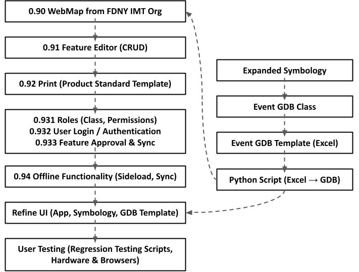

# All-Hazard IMT Web Mapping Application 
## Executive Summary

All-hazard incident management teams (AHIMT) are often tasked with responding to and managing incidents of wildly varying scope and complexity. The role of AHIMTs continues to evolve into a more data centric role due to legal issues, incident complexity, and interoperability requirements. These challenges necessitate a framework for managing geospatial data during incident assignments. Currently no standards exist specific to geospatial data management for AHIMTs like there is for the wildland fire community (NWCG<!-- Todo: add link -->).
To that end, we propose the following solution:
1. Standardized event geodatabase (EGDB) schema.
2. Pre-built web-apps, map layouts, and analysis tools that match schema.
3. Tools to allow adapting framework to mission requirements with minimal training.
4. Standard operating procedures (SOP) that defines operational procedures for handling geospatial data and associated products.

The above will allow teams to quickly establish methods for capturing, analyzing, and visualizing data while providing the flexibility required to adapt to changing situations.

## Discussion
### Event Geodatabase
- Excel spreadsheet template for incident-specific event geodatabase
- Python script to create/update/import incident-specific geodatabase to ArcGIS from template
- Expanded incident event symbology based on core of US&R template and NWCG event geodatabase
### Web Application
- Incident monitoring
- Create, read, update, and delete (CRUD) event data 
- Print format-customizable maps at product (e.g., NWCG) standard
- Permissions for query/approval based on IMT roles (GISS, SITL, IC, etc.)
- Input features based on hand-held data collection (ESRI Field Maps)
- Functional across common hardware and browsers
- Offline functionality with source feature service synchronization of edits

### Custom ArcGIS Pro Templates and Map Layouts
- ArcGIS Pro template containing
  - EGDB
  - Custom toolbox
  - Customizable map layouts
- May layouts
  - Customizable for organizational use
  - Customizable to map/product requirements
  - Dynamic text for rapid updating of map info

### Analysis Tools
- Custom Python tools to accomplish (not all inclusive)
  - ✅ Export all layouts in project
  - Start up/join/shutdown an incident
  - Create ready state AGOL deployment

## Architecture Overview

Users: 
As referenced in the figure above, users will be able to interact with the web application both from the browser and via the ArcGIS product suite. All users will be able to interact with the web application through the browser UI. Certain roles (e.g., GISS) will be responsible for “behind the scenes” work via ArcGIS. This will include setting up the event geodatabase (GDB), collecting field data, and maintaining the instanced web map in AGOL.

Browser: The core application UI (“the incident map”) runs on the web browsers of IMT hardware. The application will be designed to work offline, with synchronization occurring after reconnecting to the internet or via sideloading.

Use Cases: 
The core uses of the map application. Includes: monitoring of the incident by the IC and relevant parties (SITL, etc.), user-friendly contributions and updates to map features (including the ability to gate-keep updates behind a permission-based approval workflow), and a printing function that produces maps at desired sizes, formats, and product standards.  

Data: 
The data used by the application in performance of its functions. Includes but is not limited to the instanced WebMap from ArcGIS, presumably specific to a given incident, feature layers included in or viewed separately (e.g., NYC’s PLUTO) from the instanced WebMap, user-generated incident data consistent with the GDB, and users. The users class will include a role property from which certain app functionality will be restricted.  

GDB:
The incident-customizable event geodatabase, generated from an Excel spreadsheet template maintained by the GISSs and other applicable users. 

ArcGIS: 
The ESRI product suite, including ArcGIS Pro, AGOL, and Field Maps.

## Implementation Plan

1. Load a WebMap from AGOL and feature layers from other data sources (e.g., PLUTO) for development purposes. WebMap will eventually include the custom .gdb as created from an Excel template and accompanying python script.

2. Include an editor that will add, delete, and edit features. Choose appropriate UI for the widget that displays name and symbology of features in the gdb organized by data type (point, line, polygon) or ‘genre’ (e.g., wildfire, collapse, etc.).

3. Develop a printing widget that exports the browser view at predetermined and custom sizes and file formats. The widget should have a toggle (default) that specifies the map be produced in accordance with SOPs.

4. Define a user class, including roles and permissions. To include but not limited to: Owner, IC, SITL, Logistics, GISS, View-Only. Create a process for managing users. Include web app login and authentication. Develop a feature approval workflow. At minimum, this should include an "Approval Workflow" based on the National Incident Feature Service Workflows. 

5. Build an offline version of the application that is to be sideloaded onto mobile devices. Feature edits in the offline application should write to the “main” map pending role-based approval.

6. Refine all aspects of the user experience, including but not limited to the expanded symbology, the Event GDB template, and the web mapping application. The software should be user-friendly to those with limited technological familiarity. Procure and act upon feedback from expected users.

7. Develop regression testing scripts to be performed after software updates. The scripts should capture the full functionality of the software, including updates/modifications to the event GDB and synchronizing with offline devices.

## Current Status
- Event GDB: [event_gdb/README.md](event_gdb/README.md)
- Webapps: [webapp/README.md](webapp/README.md)
- 
## Changelog
### 2022-08-31
- Add event GDB readme: [event_gdb/README.md](event_gdb/README.md)
- Add webapp readme: [webapp/README.md](webapp/README.md)
### 2022-08-11
- Alpha version of event GDB ready
- Still in conversations with ESRI on how to best adapt the domains/contingent values of feature category after EGDB has been pushed to AGOL
- Basic webapp running
- SOP stub created
- Some layout management tools completed